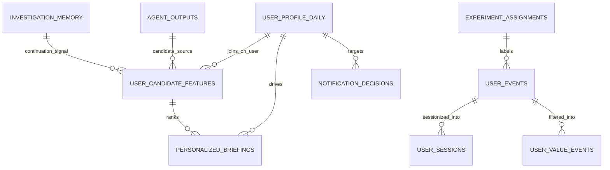
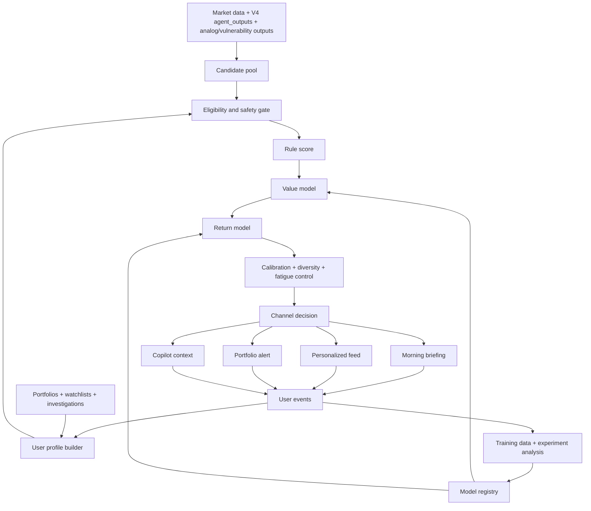

# Deplyze Quant V5 R&D Plan for Personalized Institutional Retention

## Executive summary

Deplyze Quant V5 should not be built as a generic “engagement engine.” It should be built as a **personalized institutional utility system** that makes users return because the platform continuously understands their portfolio, watchlists, active research threads, preferred reasoning style, and market context. The strongest institutional pattern in adjacent products is consistent: Bloomberg emphasizes tailored news and alerts, LSEG Workspace says its AI-powered recommendations and UX “learn from you,” AlphaSense centers saved searches, watchlists, alerts, dashboards, and event calendars, and Kensho now exposes grounded workflow skills such as tearsheets and earnings previews directly inside AI workflows. The common denominator is not endless scrolling; it is **high-signal personalization tied to workflow**. citeturn19view1turn19view0turn19view2turn19view3turn19view4

The best V5 algorithm for Deplyze is therefore a **layered, return-aware ranking system** rather than a monolithic reinforcement-learning stack. Research points in that direction. Finance recommendation papers emphasize **time-aware modeling** because financial preferences and market context are non-stationary; a 2023 BNP Paribas/RecSys paper explicitly shows that incorporating personalized time decay improves financial product recommendation accuracy, and earlier finance work argues dynamic recommendation must adapt to changing client behavior. In parallel, recommender-systems research is increasingly arguing that platforms should optimize for **return probability and long-term utility**, not only immediate engagement. citeturn17search5turn21view1turn19view7

Accordingly, V5 should be organized around a recommended algorithmic stack: **rules-based safety and relevance gating**, **content-first personalization**, **supervised value and return prediction**, **learning-to-rank reranking**, **small-scope contextual bandits for exploration and notification timing**, and **causal measurement** to ensure the system is improving behavior rather than merely harvesting attention. Pure collaborative filtering and end-to-end RL should be delayed: finance is too sparse, too dynamic, and too sensitive for those to be the starting point. Contextual bandits and offline evaluation methods are proven for dynamic recommendation settings, including news, while LambdaMART-style ranking remains a practical production choice for ordering slates. citeturn2search0turn15search0turn2search1

V5 must remain institutionally safe. The SEC has explicitly scrutinized digital engagement practices such as notifications, behavioral prompts, gamification, and predictive systems that guide investment-related behavior; SEC robo-adviser guidance also makes clear that personalized digital financial advice implicates fiduciary obligations. In parallel, trustworthy-recommender literature and the NIST AI RMF emphasize transparency, privacy, explainability, user control, and risk management, while GDPR/UK GDPR profiling guidance requires organizations to document lawful basis, explain profiles, and avoid solely automated decisions that significantly affect users without proper safeguards. For Deplyze, that means: no manipulative nudging, no trading encouragement loops, no hidden user-to-user leakage, and no personalized output that crosses from research prioritization into undisclosed individualized investment advice. citeturn25view0turn10search0turn26view1turn19view8turn23search0turn23search2turn24search1turn24search11

The practical recommendation is to ship V5 in three layers. First, launch an MVP around a **personalized morning briefing**, **portfolio vulnerability alerts**, **watchlist intelligence**, **research workflow memory**, and **Copilot personalization**. Second, train supervised ranking models and introduce calibrated confidence scoring. Third, add controlled exploration with contextual bandits and notification-timing policies once the event log is rich enough. This sequence minimizes regulatory risk, data risk, and infrastructure sprawl while maximizing the likelihood of discovering what actually drives daily return. citeturn22view0turn22view1turn16search0

## Problem and objectives

The core product problem is behavioral, not technical: **why would a user open Deplyze every market day when Bloomberg, LSEG, AlphaSense, and general market/news tools already exist?** The answer cannot be “because Deplyze has more pages.” It must be: **because Deplyze feels like a personalized institutional operator that knows what matters to this user now**. Comparable products reinforce this framing. Bloomberg is strongest when it tailors market-moving news and alerts to the user’s needs; LSEG markets “predictive discovery” whose UX adapts to the user; AlphaSense reduces repeat work with saved searches, watchlists, dashboards, event calendars, and alerts; and Kensho explicitly positions grounded AI skills as workflow accelerators for research and document generation. citeturn19view1turn19view0turn19view2turn19view3turn19view4

The primary objective for V5 is **personalization that improves qualified return**, not personalization that maximizes shallow engagement. A useful objective hierarchy is: first, increase the probability that a user experiences a relevant insight quickly after opening the product; second, increase the probability they complete a meaningful value action in that session; third, increase the probability they return on the next trading day or within the next trading week. This objective is more aligned with recent recommender research that distinguishes utility from impulse-driven engagement and suggests that return probability is a better proxy for durable user value than raw clicks alone. citeturn19view7turn22view0turn22view1

The secondary objective is **institutional tone**. Deplyze should not imitate consumer growth loops that regulators already scrutinize in financial contexts. SEC materials on digital engagement practices explicitly call out prompts, alerts, visual cues, game-like features, and predictive analytics that influence investor behavior, as well as the possibility that such systems may increase activity or risk-taking. V5 therefore should optimize for **workflow continuation, briefing relevance, research efficiency, and risk awareness**, not for addictive loops or trading stimulation. citeturn25view0turn25view2

A parallel objective is **privacy and ethical safety**. Trustworthy-recommender research treats explainability, privacy-aware recommendation, fairness, robustness, and user control as first-class requirements, not polish. GDPR and UK GDPR guidance reinforce that profiling needs a documented lawful basis and clear privacy information, and that individuals should be able to understand what information was used to create a profile. NIST’s AI RMF similarly frames AI risk management around transparency, privacy, fairness, safety, and accountability. For Deplyze, personalization should be **transparent, reversible, opt-out friendly, and auditable**. citeturn26view1turn26view2turn23search2turn24search1turn24search11turn19view8

## Prioritized use cases and user journeys

The best way to create habitual use in financial software is to tie personalization to **market-day routines and unresolved research questions**. Vendor patterns support this: Bloomberg highlights curated top news and bullet digests, LSEG emphasizes Watchlist Pulse and curated alerts, and AlphaSense emphasizes dashboards, watchlists, and event monitoring so users do not need to rerun the same work every day. citeturn19view1turn14search4turn19view2turn19view3

| Priority | Use case | Journey | Primary success event | Retention mechanism |
|---|---|---|---|---|
| High | Morning briefing | User opens Deplyze pre-market or at market open and sees a ranked briefing personalized to portfolio, watchlist, active investigations, and macro regime | Opens briefing, expands at least one evidence trail, or jumps to Portfolio / Instrument / Copilot within 60 seconds | Creates a repeatable weekday ritual |
| High | Portfolio vulnerability alerts | Overnight risk/regime/narrative changes trigger in-app or email alert with severity, evidence, and context | Alert open followed by Portfolio Risk/Scenario page visit | Anchors Deplyze to “I need to know if my book changed” |
| High | Research workflow memory | User investigates a thesis, pins symbols/themes, then Deplyze resurfaces supporting or contradicting evidence later | Return visit to an active investigation; save/share/export follow-up | Makes Deplyze feel like it remembers unfinished work |
| High | Copilot personalization | Copilot answers with the user’s preferred style, depth, benchmarks, watchlists, and active theses already grounded | Follow-up question rate, answer save/export, reduced time-to-insight | Raises answer relevance and stickiness |
| Medium | Watchlist intelligence | User maintains company/thematic watchlists; Deplyze aggregates events, filings, sentiment/narrative changes, and opportunity/risk observations | Watchlist revisit, watchlist growth, event deep dives | Encourages regular monitoring behavior |
| Medium | Personalized feed | Live Intelligence becomes user-specific rather than globally sorted | Daily feed consumption with low dismiss rate | Keeps homepage fresh and relevant |
| Lower initially | Notification timing optimization | System chooses when to send allowed alerts based on user/time/context | Open rate without unsubscribe or mute increase | Improves delivery efficiency once message quality is proven |

The **morning briefing** should be the first and most important V5 surface. It is the most direct answer to “why open daily?” The page should not be a generic dashboard; it should be a one-minute institutional note, written in calm language, answering five questions: What changed overnight? What changed in my portfolio? What changed in my watchlists? Which of my active theses gained or lost support? What deserves attention first? This aligns with Bloomberg’s “Top News” and “First Word” pattern, LSEG’s digest/watchlist pulse pattern, and AlphaSense’s dashboard/event-monitoring pattern. citeturn19view1turn21view8turn19view3

The **portfolio vulnerability alert** is the second strongest daily-return mechanic. It works because it is personalized, outcome-relevant, and bounded. It should fire only when an already-existing V4 signal crosses importance thresholds for that specific portfolio: regime incompatibility, risk concentration, volatility spike on correlated holdings, narrative breakdown in a crowded theme, or major watchlist catalyst. The user should immediately understand why it appeared, what evidence supports it, and which page to open next. This resembles LSEG’s “Next Best Actions” and watchlist pulse more than a consumer push-notification hack. citeturn21view9turn14search1

The **research workflow memory** is the most differentiated Deplyze feature if done well. Institutional research is iterative. Users do not simply consume a feed; they pursue open questions. V5 should therefore create “investigation memory” objects: an investigation may include a set of symbols, themes, questions, saved Copilot threads, pinned cards, and unresolved claims. New evidence that overlaps that graph should be prioritized even if the user has not opened the product recently. This is where Deplyze can feel unusually “human,” while remaining source-grounded and audit-friendly. Kensho’s workflow-grounded skills and Bloomberg’s research-management emphasis both point in this direction. citeturn19view4turn8search16

## Recommended algorithmic architecture

### Recommended retention algorithm

The strongest recommendation is to implement a **Return-Aware Institutional Ranking Engine** rather than a single black-box model. The engine should make one decision repeatedly: **which candidate insight should be shown to which user, in which channel, at which time, with what explanation, under which safety constraints?** The model objective should be a combination of short-term value and long-term return, not clicks alone. That choice is supported by recent “System-2” recommender work, which argues that return probability better captures long-term utility than immediate engagement, and by finance-specific recommendation work showing that time-aware and dynamic modeling are essential under non-stationary preferences. citeturn19view7turn17search5turn21view1turn21view0

A good production sequence is:

1. **Candidate generation** from existing V4 outputs: `agent_outputs`, analog/vulnerability/narrative surfaces, watchlist events, saved searches, and workflow-memory matches.  
2. **Eligibility and safety gating** via deterministic rules: suppress low-confidence items, duplicates, over-frequent alerts, unsupported claims, low-data situations, and anything that could look like individualized trade nudging.  
3. **Rules-based base score** using portfolio impact, watchlist overlap, investigation overlap, severity, confidence, novelty, recency, and fatigue penalties.  
4. **Supervised value model** predicting the probability of a meaningful action such as evidence expansion, save, scenario run, or Copilot follow-up.  
5. **Return model** predicting qualified next-trading-day or next-week return probability conditional on exposure.  
6. **Learning-to-rank reranker** for ordering the final slate.  
7. **Contextual bandit layer** on a small exploration budget for top positions and timing decisions only.  
8. **Calibration and explanation layer** to convert raw model scores into honest probabilities and user-facing reason codes.  

This architecture is production-friendly because it preserves a hard safety envelope while allowing increasingly data-driven ranking over time. It also matches what institutional users need: not “the most clickable” card, but “the most portfolio-relevant, credible, and timely card.” The justification for a staged ranker is also strong from the literature: LambdaMART remains a practical real-world ranking approach, contextual bandits work well when content pools change quickly and unbiased offline evaluation matters, and time-aware financial recommendation literature repeatedly emphasizes temporal drift. citeturn2search1turn2search0turn15search0turn17search5turn21view1

A practical first scoring function can be simple and explicit:

`BaseScore = Gate × (0.30 PortfolioImpact + 0.20 WatchlistMatch + 0.15 InvestigationContinuation + 0.10 RegimeUrgency + 0.10 Confidence + 0.05 Novelty + 0.05 Recency + 0.05 SourceQuality - 0.10 FatiguePenalty - 0.10 DuplicationPenalty)`

Then, once enough impressions accumulate, that score becomes a feature in the reranker rather than the final decision.

### Algorithm choice comparison

The table below is a synthesized recommendation informed by the ranking, bandit, finance-recommendation, calibration, and trustworthy-recommender literature. citeturn2search1turn2search0turn15search0turn17search5turn26view1turn27view0

| Approach | Pros | Cons | Infra cost | Data needs | Expected lift | Explainability |
|---|---|---|---|---|---|---|
| Rule-based ranking | Fast to ship, deterministic, easy to audit, perfect for safety constraints | Hard to personalize deeply, brittle, plateaus quickly | Low | Low | Low to moderate | Very high |
| Supervised engagement/value prediction | Learns from behavior, easy to start with GBDT/logistic regression, good for scoring individual items | Can optimize shallow actions if labels are weak; confounded logs | Low to medium | Medium | Moderate | High with SHAP/reason codes |
| Learning-to-rank | Best for ordering multi-card slates like briefing/feed; directly optimizes ranking quality | Needs impression/order labels and query-grouped training data | Medium | Medium to high | Moderate to high | Medium to high |
| Contextual bandits | Handles dynamic candidate sets and exploration; well-suited to sparse, changing environments | Requires careful safeguards and unbiased logging; over-exploration is risky in finance UX | Medium | Medium | Moderate to high | Medium |
| RL for notification timing | Targets long-term utility/fatigue trade-offs and sequencing | High complexity, fragile rewards, slower to trust | High | High | Moderate after maturity | Low to medium |
| Content-based personalization | Great cold start; natural fit for symbols, themes, regimes, sectors, narratives; easy to explain | Can miss serendipity and peer-pattern discovery | Low | Low to medium | Moderate | Very high |
| Collaborative filtering | Can capture latent affinity and serendipity across users | Cold start, sparsity, privacy concerns, weak institutional explainability | Medium | High | Moderate only after scale | Low |
| Hybrid content + CF | Best long-run fit once data is rich; combines explainability and discovery | More complex infrastructure and governance | Medium to high | High | High | Medium |
| Causal uplift modeling | Measures who actually benefits from a treatment; useful for alerts and messaging | Requires experiments or strong assumptions | Medium | Medium to high | High for targeting efficiency | Medium |

### Content-based, collaborative, and hybrid recommendation

For Deplyze, **content-based personalization should dominate early**. Financial items already have rich structure: symbols, sectors, narratives, macro regimes, risk themes, filing types, event times, portfolio overlap, and source quality. Deplyze also already has V4 cognitive outputs such as vulnerability, analogs, and narrative exposure that can be turned into structured features. That makes content-based ranking immediately useful and unusually explainable: “shown because it affects 18% of your portfolio, overlaps your AI-infrastructure watchlist, and contradicts the thesis you saved yesterday.” Finance recommendation research also strongly supports explicit temporal context and personalized decay, which pairs naturally with content-first ranking. citeturn17search5turn21view1turn21view0

**Collaborative filtering should be deferred and constrained.** It becomes useful only after enough users produce consistent behavior signals, and in institutional finance it introduces extra privacy and governance questions because user behavior may reveal sensitive interests. If collaborative signals are introduced later, they should be derived from **k-anonymous aggregated behavior**, not raw cross-user portfolio inspection, and they should remain a weak feature inside a hybrid model rather than the dominant engine. Trustworthy-recommender literature is directly relevant here because personalization based on private data can erode trust if it is opaque or uncontrollable. citeturn26view1turn26view2

The long-run target should be **hybrid ranking**, but hybrid in an institutional sense: content-based portfolio relevance and workflow memory as the backbone, collaborative signals as a small discovery boost, and explicit calibration/diversity constraints so the system does not collapse into one repetitive theme. Spotify’s recommendation-calibration work is helpful here because it formalizes the idea that users’ minority interests should not be crowded out by dominant themes or popular items. In Deplyze, that means a macro-focused user who also follows semiconductors should still see both when both are truly relevant. citeturn27view2

### Feature engineering

The feature space should be organized around **who the user is, what they own/watch, what they are working on, and what changed**.

| Feature family | Examples | Implementation note |
|---|---|---|
| Portfolio identity | concentration, sector weights, growth vs defensive tilt, factor/proxy exposures, benchmark overlap | Derived nightly from holdings and exposure engines |
| Regime sensitivity | sensitivity to yields, inflation, liquidity, volatility, credit spread widening, USD strength | Reuse V4 vulnerability and analog outputs |
| Narrative exposure | AI, semis, consumer weakness, energy, rates, supply chain, earnings-risk | Reuse V4 narrative exposure and ontology/narrative memory |
| Watchlist affinity | symbol overlap, thematic overlap, event proximity, earnings window | Updated intraday |
| Workflow memory | pinned theses, saved investigations, recent Copilot threads, unresolved questions | New “investigation memory” objects |
| Behavioral signals | impression, open, expand evidence, dwell, save, dismiss, share, export, scenario run, follow-up query | Event-level logging with temporal decay |
| Temporal signals | recency, user-specific half-life, time-of-day, day-of-week, pre-market vs intraday, market holidays | Trading-calendar aware |
| Fatigue and noise | recent alert count, recent dismissals, same-theme saturation, message repetition | Critical to avoid over-notifying |
| Quality/confidence | source count, source class, data freshness, calibrated model probability, data sufficiency flag | Used for both ranking and user-facing confidence |

A strong temporal strategy is to use **two simultaneous decays**: a short decay for fresh behavior and a longer decay for stable style. For example, the user’s “active investigation” or “current thematic attention” can have a 7–14 day half-life, while their deeper style identity—macro-first, bottom-up, earnings-heavy, benchmark-relative, or risk-sensitive—can have a 60–90 day half-life. That follows the logic of finance recommendation work showing that the utility of past interactions fades over time and that different users decay at different rates. citeturn17search5turn21view1

### Contextual bandits and notification timing

Contextual bandits are appropriate for Deplyze **after** the product proves that the underlying content is good. They are especially useful for dynamic feeds and alerts because the candidate pool changes quickly and feedback is sparse. Yahoo!’s contextual-bandit news paper reported a 12.5% click lift over a standard context-free bandit and paired it with a clean unbiased offline evaluation method—important because Deplyze will also need safe offline policy testing before exposure. citeturn2search0turn15search0

For **notification timing**, do not start with full RL. Start with a conservative contextual-bandit or sleeping/recovering bandit policy. Duolingo’s recurring-notification work is relevant because it models novelty and recovery rather than blindly treating every opportunity as identical, and action-centered contextual-bandit research similarly emphasizes the importance of a “do nothing” baseline in human-centered intervention settings. Deplyze should only optimize timing for **opted-in, already-valuable alerts**, and should cap notification pressure by user and channel. citeturn4search4turn4search1turn22view4

### Causal inference, confidence scoring, and explainability

Causal inference is not optional if V5 is serious about retention. Recommendation logs are confounded: users click what they are shown, and they are shown what previous systems thought they might click. The causal-recommendation literature explicitly frames this as a core problem and links it to offline policy evaluation, counterfactual reasoning, and uplift modeling. For Deplyze, causal methods belong in two places: **measurement** of whether personalization truly improved return, and **treatment targeting** for alerts, digests, and reminder cadences. citeturn21view4turn3search0turn3search17

User-facing confidence should be calibrated, not guessed. Scikit-learn’s calibration documentation is a good practical reference: reliability diagrams compare predicted probabilities to empirical outcomes, and Brier/log-loss alone are not enough to judge calibration by themselves. For recommender outputs specifically, calibration also matters at the list level: recommendation sets should reflect the breadth of user interests rather than crowd everything into one dominant cluster. The simplest V5 rule is to present confidence as **Low / Medium / High + reason codes + evidence sources**, not pseudo-precise percentages, until calibration is stable. citeturn27view0turn27view2turn18search17

## Data, privacy, and evaluation

### Data requirements and schema changes

V5 needs a dedicated behavioral data layer. Today’s V4 intelligence stack already produces excellent candidates; V5 now needs to learn from how users consume them. The minimum event model should log: session start/end, page view, candidate impression, candidate open, evidence expand, save, dismiss, pin, share/export, watchlist add/remove, portfolio import/update, alert send/open/dismiss, briefing open, Copilot query/follow-up, investigation create/update/close, and explicit feedback events such as “less like this” or “follow this theme.” This event spine is what allows Deplyze to estimate value, return, fatigue, and workflow continuation rather than just page traffic. Product-analytics docs from Amplitude and Mixpanel both emphasize retention analysis from an initial event and the need to track how users return to value over time, while Amplitude’s time-to-value work argues that the path from signup to meaningful outcome is what predicts retention. citeturn19view9turn22view1turn22view0

A pragmatic schema recommendation, designed to fit the current BigQuery/Cloud Run/Firebase stack without unnecessary platform sprawl, is shown below.

| Layer | Proposed table or store | Purpose |
|---|---|---|
| BigQuery raw | `raw_app.user_events` | Immutable behavioral event log |
| BigQuery cleaned | `cleaned.user_sessions` | Sessionized events with market-calendar enrichment |
| BigQuery cleaned | `cleaned.user_value_events` | Explicit value-event spine for retention analysis |
| BigQuery features | `features.user_profile_daily` | Daily user style/profile snapshot |
| BigQuery features | `features.user_candidate_features` | Point-in-time user × candidate features for ranking |
| BigQuery features | `features.user_notification_features` | Timing/fatigue/channel features |
| BigQuery artifacts | `artifacts.personalized_briefings` | Materialized morning briefings and ranked items |
| BigQuery artifacts | `artifacts.notification_decisions` | Alert decision logs, outcomes, policy version |
| BigQuery artifacts | `artifacts.investigation_memory` | Active investigations, entities, theses, state |
| BigQuery ML | `ml.training_examples_ranking` | Labels for ranking/LTR |
| BigQuery ML | `ml.training_examples_uplift` | Treatment/control examples for uplift |
| BigQuery ops | `ops.experiment_assignments` | A/B and bandit assignments |
| Online store | Firestore `user_profiles/{uid}` | Low-latency profile mirror for Feed/Copilot |
| Online store | Firestore `investigations/{uid}/{id}` | Low-latency workflow-memory objects |



The feature store should remain **BigQuery-backed first**, with an online Firestore mirror only for the small subset of fields needed for low-latency inference. This keeps point-in-time joins, reproducibility, and cost discipline under control. A dedicated external feature-store platform can wait until online bandits or sub-100ms ranking latency make it necessary.

### Privacy and compliance constraints

V5 should treat personalization as **profiling for relevance**, not as hidden persuasion. GDPR/UK GDPR guidance is clear that organizations need a lawful basis for profiling, must explain how people can access details of the information used to create their profile, and must be careful when decisions are based solely on automated processing and significantly affect individuals. Purpose limitation and data minimization rules also require organizations to define why data is collected and to process only what is necessary. citeturn23search0turn23search2turn24search1turn24search11turn24search5

For Deplyze, that translates into concrete controls:

- Behavioral profiles must be **pseudonymous** in analytics tables; direct identity remains in Firebase Auth or a separate access-controlled store.
- Personalization purposes must be explicitly documented in privacy notices and internal docs as: briefing ranking, alert prioritization, workflow continuity, and Copilot context improvement.
- Users should have visible **controls** over alert categories, alert frequency, and whether cross-session memory is used by Copilot.
- Cross-user signals used for collaborative features must be **aggregated and thresholded**; no one user’s portfolio or research trail should ever become legible to another user through recommendations.
- User-facing outputs should explain **why the card or alert was shown** and allow dismissal or interest adjustment.
- When personalization touches anything close to individualized investment advice, human-review and legal review thresholds rise materially. SEC robo-adviser guidance is a reminder that digital financial advice is not exempt from fiduciary expectations simply because it is algorithmic. citeturn10search0turn25view1turn25view0

A simple institutional rule is: **Deplyze may personalize research prioritization, but it must not personalize pressure to trade**. That line matters both ethically and strategically.

### Evaluation metrics and experiments

V5 should measure **qualified retention**, not vanity engagement. The cleanest north-star metrics are:

- **Market-Day Qualified Active Users (MDAU-Q)**: unique users on trading days who complete at least one value event.
- **D1 / D5 / D20 market-day retention** from the first value event.
- **Time-to-first-relevant-insight**: login to first evidence expansion, save, scenario run, or Copilot follow-up.
- **Briefing value rate**: fraction of briefing opens that lead to a downstream value event.
- **Alert precision@k** and **false-positive rate**.
- **Copilot personalized follow-up rate**.
- **Dismiss-without-open** and **mute/unsubscribe** as noise counters.
- Standard company metrics: DAU, WAU, MAU, DAU/WAU, session length, NPS/trust score.  

This follows standard retention-analysis logic from Amplitude and Mixpanel, but adapts it to the reality that financial software should be measured against trading rhythms and qualified actions, not generic daily app opens. citeturn19view9turn22view1turn22view0

Offline evaluation should use **temporal cross-validation**, not random train/test shuffles, because financial behavior is regime-sensitive. Ranking models should be evaluated by NDCG, MAP, AUC/log loss, and calibration metrics such as reliability diagrams and Brier/log-loss diagnostics. If bandits are introduced, preserve randomized logging so that off-policy evaluation remains credible. Contextual-bandit evaluation literature and causal-recommendation surveys both reinforce the value of unbiased or counterfactual evaluation before online rollout. citeturn15search0turn21view4turn27view0

Online evaluation should rely on controlled experiments, but with sensitivity improvements. CUPED is directly relevant because it uses pre-experiment data to reduce variance and reportedly achieved about 50% variance reduction in Bing experiments, effectively doubling traffic or halving duration for the same sensitivity. Experimentation literature also warns that long-term effects require long-term metrics and that online metrics are easy to misread if teams fixate on one short-term signal. citeturn16search0turn11search2turn11search6

Recommended test choices are:

- **Binary outcomes** such as D5 retention, alert open, mute/unsubscribe: two-proportion z-test or logistic regression with covariates.
- **Continuous outcomes** such as session length or time-to-first-insight: CUPED-adjusted t-test or bootstrap confidence intervals.
- **Sequential monitoring**: group sequential testing rather than peeking naïvely; Spotify’s experimentation notes are a useful model for this. citeturn16search2turn16search0

Illustrative sample sizes for two-arm tests, using a two-sided 5% significance level and 80% power, are below.

| Metric | Baseline | Target | Approx. users per arm |
|---|---:|---:|---:|
| D5 retention | 25.0% | 27.5% | 4,862 |
| D5 retention | 25.0% | 26.5% | 13,338 |
| D20 retention | 15.0% | 18.0% | 2,402 |
| Briefing open rate | 40.0% | 44.0% | 2,389 |

These are illustrative only; the exact numbers should be recomputed once Deplyze’s baseline event rates and user volumes are known.

## Deployment architecture and integration points

This plan is designed to **reuse V4 rather than rebuild it**. The assumption from the current project context is that Deplyze already has working agent outputs, reasoning surfaces, portfolio intelligence, a gateway, and a Research Copilot grounding layer. V5 should sit on top of that.

The safest Phase 1 architecture is to add a `personalization` module **inside the existing quant-engine/gateway pattern**, not to spawn a large new microservice estate immediately. That keeps operational boundaries simple while the product still learns what matters. If later phases require lower latency or independent deploy cadence, the module can be split into a dedicated `deplyze-personalization` Cloud Run service.



The key integration points are straightforward:

- **Intelligence Feed** becomes user-specific rather than globally sorted.
- **Portfolio Overview / Risk / Scenario pages** receive vulnerability- and watchlist-aware prioritization.
- **Research Copilot** gets a new `user_profile_snapshot` and `active_investigations` context block.
- **Morning briefing** becomes a first-class route, likely homepage-default for logged-in users with portfolios or watchlists.
- **Notifications/digests** use the same candidate model but a different channel policy.

A practical endpoint set is:

- `GET /v1/personalization/briefing`
- `GET /v1/personalization/feed`
- `POST /v1/personalization/alerts/score`
- `GET /v1/personalization/profile`
- `POST /v1/personalization/feedback`
- `GET /v1/personalization/copilot-context`
- `GET /v1/personalization/watchlist`

Suggested scheduler jobs:

- nightly user-profile build
- pre-market briefing materialization
- hourly watchlist-event refresh
- daily experiment aggregation
- weekly model training
- daily calibration report
- optional alert-fatigue reset or policy update job

Key environment variables/flags:

- `PERSONALIZATION_ENABLED`
- `PERSONALIZATION_RULES_ONLY`
- `PERSONALIZATION_MODEL_VERSION`
- `BANDIT_ENABLED`
- `BANDIT_EXPLORATION_RATE`
- `MAX_ALERTS_PER_DAY`
- `MIN_ALERT_CONFIDENCE`
- `PROFILE_STORE_BACKEND=firestore`
- `QUALIFIED_RETURN_EVENT_SET`
- `PSEUDONYMIZE_USER_IDS=true`

If Firebase is touched at all, it should likely be for **Firestore security rules on profile/investigation documents**, not for hosting changes.

Rollback should be simple by design: turn off the model flags, preserve deterministic eligibility gates, and fall back to severity/confidence ordering from the existing V4 intelligence surfaces. This is important both product-wise and regulatorily: if a ranking model drifts, the platform should degrade gracefully into a less personalized but still institutionally credible state. The need for explicit, auditable risk controls is consistent with NIST AI RMF and the SEC’s focus on predictive systems in investment contexts. citeturn19view8turn25view0turn25view2

## Phased roadmap, effort, and team

The right roadmap is **evidence-first**. Build the minimum layer that can plausibly move retention, instrument it well, then graduate into more adaptive models only if the evidence says personalization is working.

| Quarter / sprints | Deliverables | Owners |
|---|---|---|
| Q3 2026, Sprints 1–2 | Event taxonomy, BigQuery event tables, sessionization, user-profile schema, Firestore profile mirror, privacy notice updates, feature flags | Product, Data Eng, Backend, Security/Legal |
| Q3 2026, Sprints 3–4 | Rules-based personalized morning briefing, portfolio vulnerability prioritization, watchlist intelligence, investigation memory MVP, Copilot profile injection | Backend, Frontend, Applied Research, Design |
| Q4 2026, Sprints 5–7 | Supervised value model, return model, confidence calibration, explanation/reason codes, experiment framework, CUPED-enabled dashboards | ML Eng, Data Science, Analytics |
| Q4 2026, Sprints 8–10 | Learning-to-rank reranker for briefing/feed, diversity controls, fatigue caps, channel scoring, offline backtesting and segment analysis | ML Eng, Backend, Analytics |
| Q1 2027, Sprints 11–12 | Contextual bandit for top-slot exploration and notification timing, uplift models for alert targeting, governance hardening, documentation | ML Eng, Analytics, Security/Legal, Product |

A reasonable team shape is:

- **Product lead** for value-event definitions, priorities, experiments, and institutional tone.
- **Applied ML / ranking engineer** for feature engineering, supervised models, ranking, calibration, bandits.
- **Data engineer / analytics engineer** for event pipeline, sessionization, point-in-time training data, experiment warehouse logic.
- **Backend engineer** for gateway/Cloud Run integration and profile APIs.
- **Frontend engineer** for morning briefing, ranking-aware feed, and profile controls.
- **Designer / UX researcher** for briefing design, explanation UI, dismiss/feedback ergonomics.
- **Security / legal partner** for profiling, alerts, and disclosure boundaries.

Estimated effort, assuming normal team capacity, is roughly **10–12 sprints** to reach a credible V5 beta and **another 4–6 sprints** for bandits, uplift, and hardening.

## Risks, MVP, follow-up experiments, and Claude handoff

The biggest product risk is **optimizing the wrong target**. If V5 optimizes opens or clicks, it can accidentally become noisier while appearing “successful.” The mitigation is to anchor the north star around **qualified return and value actions**, in line with both product-analytics best practice and the return-aware recommendation literature. citeturn19view7turn19view9turn22view1

The second risk is **regulatory and trust drift**. A financial product that personalizes too aggressively can begin to look like it is manipulating investor behavior. SEC materials on digital engagement practices are a warning here, especially around prompts, notifications, gamification, and predictive systems tied to investment-related outcomes. The mitigation is a strict safety gate, restrained alert volume, no gamified patterns, explicit explanation of why something was shown, and a standing rule that Deplyze personalizes research relevance, not pressure to act. citeturn25view0turn25view2

The third risk is **data sparsity and cold start**. Most users will not generate enough events initially for sophisticated collaborative methods. The mitigation is to begin with content-based and rules-based personalization, where Deplyze has a natural advantage because V4 already produces structured financial candidates with portfolio, regime, and narrative attributes. citeturn17search5turn21view1

The fourth risk is **feedback loops and theme collapse**. A system that keeps showing AI or macro risk simply because the user interacted once can quickly become repetitive. The mitigation is explicit diversity, calibration, and fatigue controls, plus list-level constraints so minority interests do not disappear. citeturn27view2turn27view0

The prioritized MVP should be intentionally narrow:

1. **Personalized morning briefing** with rule-based ranking and explanation tags.  
2. **Portfolio vulnerability alerts** with hard thresholds and alert caps.  
3. **Research workflow memory** for active investigations and Copilot personalization.  
4. **Watchlist intelligence** powered by saved searches, catalysts, and event calendars.  

That MVP is enough to test the real retention hypothesis: *do users return more often when Deplyze acts like a personalized institutional research operator?*

The first three follow-up experiments should be:

- **Experiment A:** personalized morning briefing vs global morning briefing.  
  Primary metrics: D5 market-day retention, time-to-first-relevant-insight, briefing value rate.

- **Experiment B:** rule-based alert timing vs fixed-time alert delivery.  
  Primary metrics: alert precision@k, open rate, mute/unsubscribe rate, next-day return.

- **Experiment C:** personalized Copilot context vs generic Copilot context.  
  Primary metrics: follow-up rate, answer save/export, time-to-answer-accepted, session depth.

The short prompt to append for Claude is:

```text
At the end of the implementation, provide:
1) a deployment handoff that lists the exact Cloud Run services, gateway routes, BigQuery tables/schemas, Scheduler jobs, environment variables, and Firebase rules (if applicable) that require deployment, migration, or verification; and
2) the exact short deploy prompt for the deploy agent to push the branch, commit the changes, open a PR, and deploy only the required backend/data/rules changes. Do not include frontend hosting unless Firebase rules changed.
```